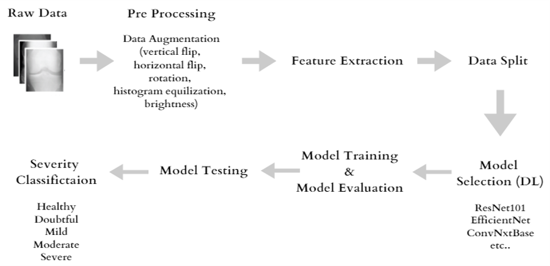
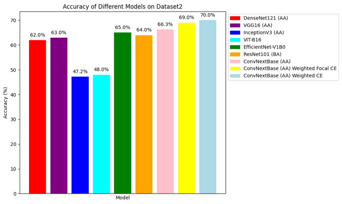
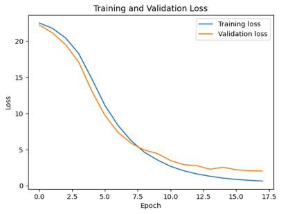
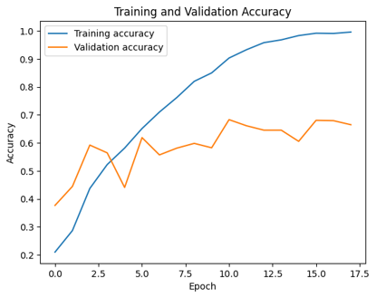
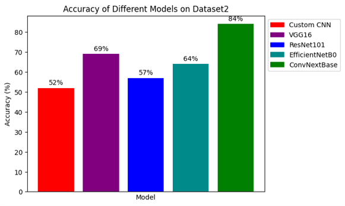
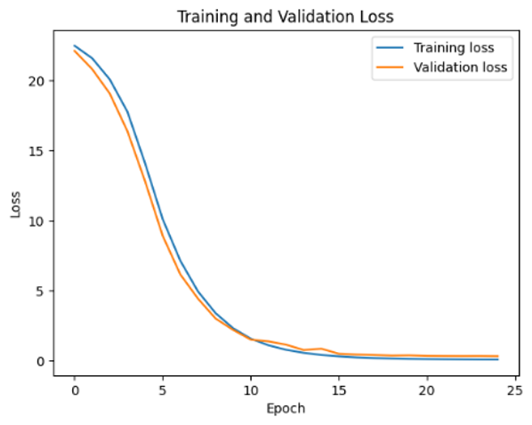
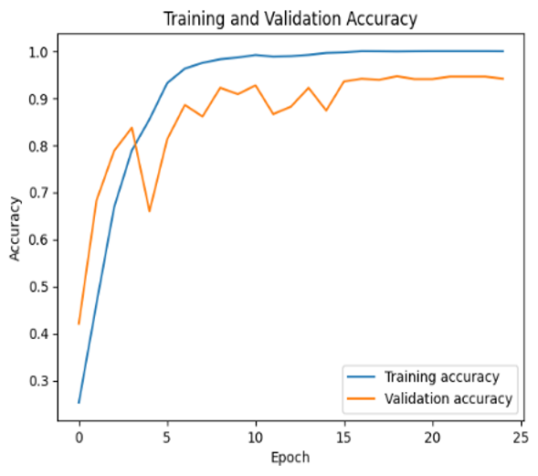
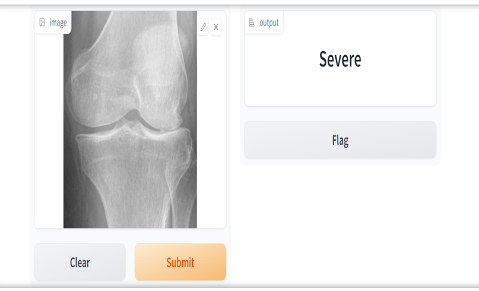

# Knee Osteoarthritis Severity Detection Using Deep Learning

## Introduction
In this project, we have developed a sophisticated Deep Learning model tailored for the precise categorization of knee osteoarthritis severity, ranging from levels 0 to 4. The primary objective is to revolutionize early diagnosis and treatment planning for Knee OA, a degenerative joint disease with global implications. Timely detection is critical to improving treatment outcomes and enhancing the quality of life for affected individuals.

## Project Overview
Knee Osteoarthritis is a prevalent joint disease, predominantly affecting older adults. Our model is designed to automate the detection and classification of OA severity from knee X-ray images. This automation represents a substantial advancement over traditional manual diagnosis methods, which are not only time-consuming but also susceptible to errors.

## Datasets
We leveraged two principal datasets for this project:
- **Mendeley Data Platform Dataset (DS-1):** Encompassing over 8,200 X-ray images meticulously labeled from 0 (healthy) to 4 (severe).
     (https://data.mendeley.com/datasets/56rmx5bjcr/1)
- **Kaggle Dataset (DS-2):** Consisting of high-quality X-ray images (1,200) with expert medical labeling, specifically developed to enhance dataset richness.
  (https://www.kaggle.com/datasets/tommyngx/digital-knee-xray/data?select=MedicalExpert-I)
- Both datasets were preprocessed to ensure image quality and address class imbalances.
- Labeled from 0-4 based on severity  (0-healthy, 1-doubtful, 2-mild, 3-moderate, 4-severe)

## Methodology
Our methodology involves multiple stages:
1. **Data Preprocessing:** Including resizing, normalization, grayscale conversion, histogram equalization, and noise removal.
2. **Data Augmentation:** Mitigating class imbalance and enhancing dataset diversity.
3. **Model Development and Training:** Implementation and evaluation of various Deep Neural Network (DNN) models, including Custom CNN, ResNet101, EfficientNetV2, and ConvNextBase. We experimented with different loss functions and Learning Rate schedulings, including custom approaches
4. **Performance Evaluation:** Utilizing metrics such as confusion matrix, accuracy, precision, recall, and F1-score to assess model performance.

  

   
## Results
Our efforts culminated in a breakthrough in Knee Osteoarthritis severity detection. Notably, the ConvNextBase model achieved an exceptional accuracy of up to 84% post-data augmentation and processing with Dataset 2. It is noteworthy to mention that, according to our extensive research, this represents the highest-ever accuracy recorded with Dataset 2, underscoring the significant impact and advancements achieved in our project. These results not only showcase our commitment to excellence but also set a new standard in the accurate classification of Knee OA severity.

**Dataset-1:**

  
  
  

**Dataset-2:**

  
  
  

**GUI:**

  

## Conclusion
Our Deep Learning models present a pioneering approach to detecting Knee Osteoarthritis severity, providing a valuable tool for healthcare professionals. While challenges persist in dataset size and model complexity, our project stands as a noteworthy advancement in the realm of medical imaging analysis.
## Acknowledgements
I extend my special thanks to the Department of Computer Science at Sam Houston State University for their unwavering support and valuable resources.
